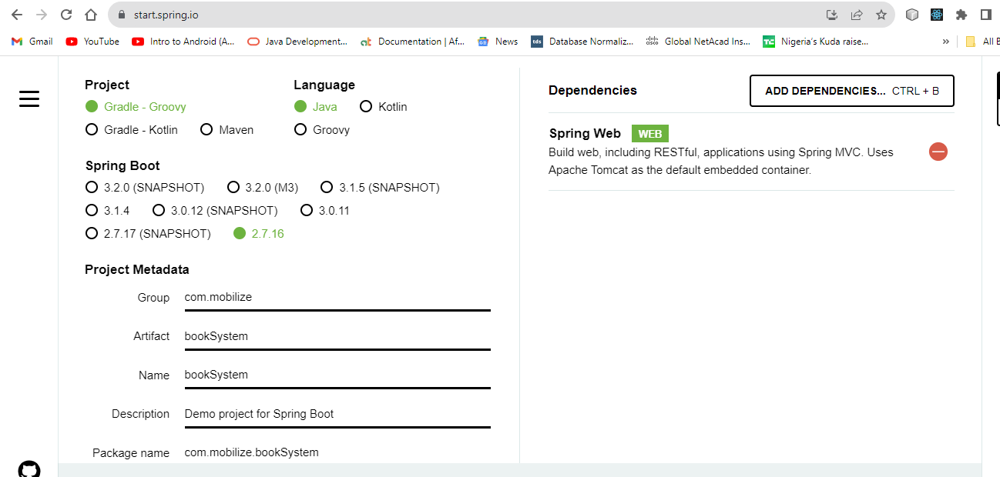
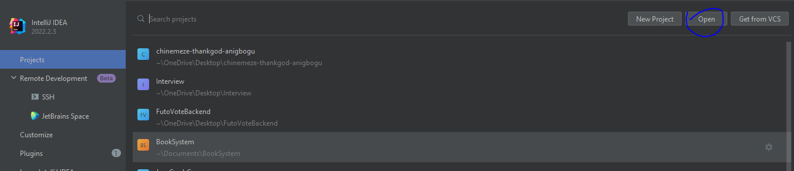
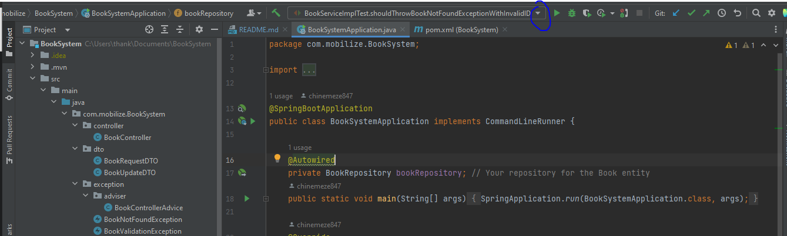
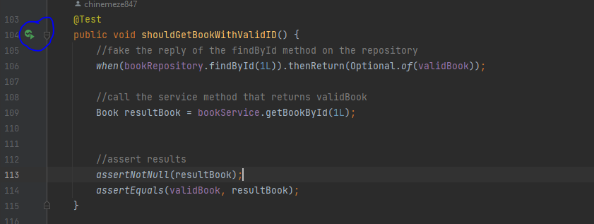

# Book_Management_System

## Description
This API manages the creation, fetching, updating, deletion and searching of books to and from the database

## Technologies 
* **JPA** It is used as the ORM (object relational mapping) in this project
* **Junit 5** It is used as the testing framework 
* **Java 17** The version of java used for the project
* **Maven** It is the build tool used for dependency management
* **MySQL DB** It is used as the database system to store the books
* **Mockito** It is used to fake or mock the repository methods for testing
* **Docker** Containerizes the application to run on multiple platforms 

## Dependencies
* **starter-web** Allows for RESTful applications using Spring MVC
* **starter-data-jpa** uses JPA to store data in a relational database
* **dev-tools** Improves the development experience by providing the live reload feature
* **mysql-connector-j** Allows the api to connect to a mysql database
* **starter-validation** provides validation feature to our models
* **lombok** It reduces the unused code from the java applications.
  It is automatically generating the getter and setter method for the class object by using Lombok annotation
* **starter-test** It allows us to test our application

## Installation
In order to run this project the following should be installed on your local machine
* **JDK** The Java development kit should be installed on your system and the path to it's bin should be include in your environment variables
* **Maven** The maven is used for dependency management
* **Intellij IDEA** The development environment that you can use to run this project

## Usages
* Go to this website https://start.spring.io/ an initialize the spring project and download it as a zip folder if you are starting a new project

* In order to use this project you can clone this repository to your local machine using ```git clone https://github.com/chinemeze847/book_management_system.git```


* Unzip the folder and import it into your intellij


* The project can now be ran using the green run button in the top right corner of intellij IDEA 

## Configuration
I set up some environment variables, by clicking on the button circled blue below an edit configuration window will pop up that allows you to add or edit environment variables


For this project the following environment variables were used;
* **HOST_NAME** The name of the host in this case it's localhost since it's running on local
* **PORT** The port on which the database runs
* **DB_NAME** The name of the database
* **USERNAME** The name of the user of the database
* **PASSWORD** The password of the user used to access the database

## Project Structure
The project in arranged in packages and java classes for proper separation of concerns

### Packages
* **Controller** This package contains the controller class that handles the http request from the user
* **dto(data transfer object)**  It contains the request objects to be use to make the api calls
* **exception** It Contains all the possible exceptions that could occur and and adviser class that handles these exceptions
* **model** It contains the Book model class
* **repository** It contains the book repository that extends the JPARepository that provides methods to interact with the database
* **service** It contains the service interface and it's implementation that handles the business logic
* **test** It contains the test class for the service layer

## API Documentation
Follow the link below to view the API documentation generated with postman
https://documenter.getpostman.com/view/16028426/2s9YJW4kC3

## Tests
Inorder to run the test click on the green button that appears behind the method name in the file located in com/mobilize/BookSystem/service/BookServiceImplTest.java

It will provide you with options like running the test or using the debug mode
you can run it in debug mode to check for irregularities
